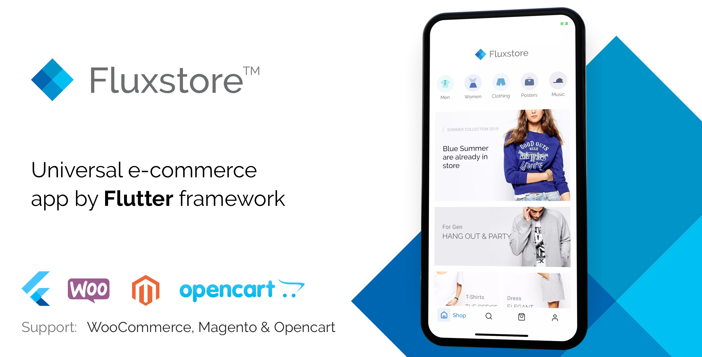

## 1. Introduction

**What is Fluxstore?**

Fluxstore is a universal e-commerce app inspired by Flutter framework, made by Google. With the mission of reducing thousands of hours of business spent on designing, developing and testing a mobile app, Fluxstore comes as a complete solution for optimizing to deliver your app to the market with high productivity and cost-efficiency. It could be able to satisfy all of the business requirements including e-commerce functionalities, impressive UX design and smooth performance on both iOS and Android devices.

If your business has already had the website, then it is easy to integrate with Fluxstore by just a few steps, and quickly release the final app to both Appstore and Google Play store. The download package is included the full source code and many related resources (designs, documents, videos…) that help you install in the smoothest way. 

- [FluxStore Pro](https://1.envato.market/40oN3): use for **Woocommerce, Opencart 3.x, or Magento 2.x** websites.
- [FluxStore WooCommerce](https://1.envato.market/QL4d9): use for only Woocommerce website.
- [FluxStore Multi Vendor](https://1.envato.market/NW4q1): use to build the Marketplace app, require your WooCommerce site and **Dokan** or **WCFM** plugin.
- [FluxStore Listing](https://1.envato.market/7qoVO): use for **Listeo, ListingPro, or MyListing** woocommerce template.
- [FluxStore Shopify](https://1.envato.market/o9vAg): use for any **Shopify** website.
- [FluxStore Prestashop](https://1.envato.market/7YDad): use for the **Prestashop** website.

## 2. Installation Guide

Please refer to the documentation guide below to know how to install, customize, and publish to app store & google play.

You can subscribe to the Youtube [InspireUI Channel](http://youtube.com/inspireui?sub_confirmation=1), like, and press the bell icon to get notifications for free instructional videos.

## 3. Reference links

| Official website | https://fluxstore.app/                                       |
| ---------------- | ------------------------------------------------------------ |
| Company website  | [https://inspireui.com](https://inspireui.com/)              |
| Fluxstore apps   | [Fluxstore Pro](https://1.envato.market/40oN3), [Fluxstore Woocommerce](https://1.envato.market/QL4d9), [Fluxstore Multi vendor](https://1.envato.market/NW4q1), [Fluxstore Listing](https://1.envato.market/7qoVO), [FluxStore Shopify](https://1.envato.market/o9vAg), [Fluxstore Prestashop](https://1.envato.market/7YDad) |
| Youtube channel  | https://www.youtube.com/inspireui                            |
| Medium blog      | https://medium.com/@inspireui                                |
